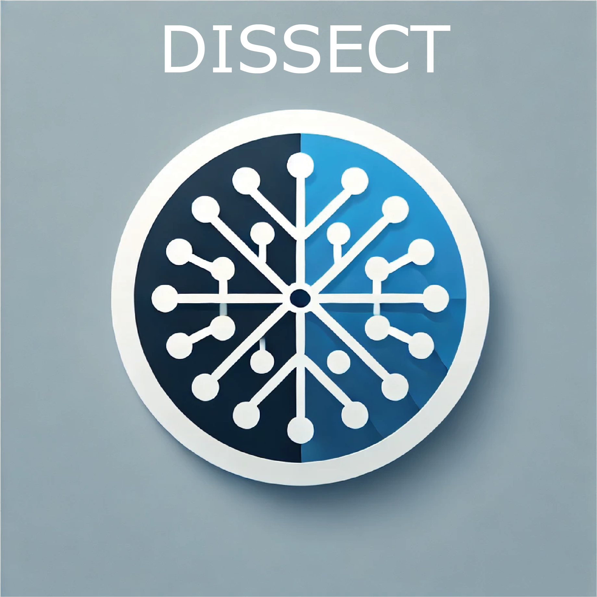
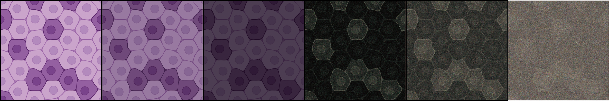
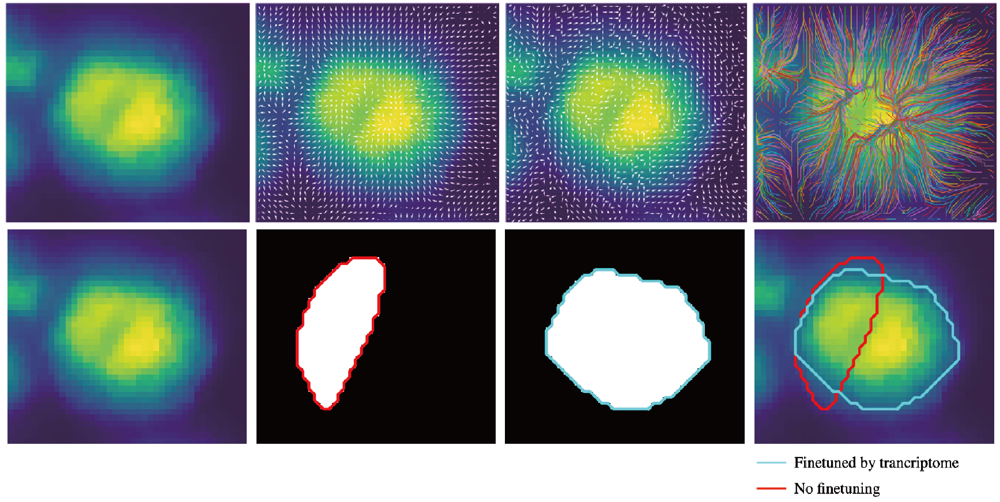

# DISSECT: Diffusion-based Cell Segmentation Integrating Spatial Transcriptomics



**DISSECT** (**DIffusion-based cell Segmentation integrating Spatially rEsolved transCripTome**) is an advanced cell segmentation algorithm developed by the Zeng Lab. It combines cytological image segmentation with transcriptome-guided fine-tuning to achieve precise spatial transcriptome reconstruction.

DISSECT leverages a pre-trained deep generative model to identify cell nuclei or membrane boundaries. By unifying the gradient fields of cytological images and transcriptomics data, it refines cell boundaries and reconstructs spatial single-cell transcriptomes.

---

## Key Features
- Integration of **deep generative models** for segmentation.
- Combines **spatial transcriptomic data** with image analysis for enhanced accuracy.
- Supports transcriptomics data from multiple platforms:
  - **10X Xenium**
  - **BGI Stereo-seq**
  - **Nanostring CosMx**
- Outputs include refined cell masks, bounding boxes, and spatial transcriptomes for downstream analyses.



---

## Dependencies
Below are the essential libraries required to use DISSECT:

- **Python Packages**:
  - `numpy`
  - `pandas`
  - `torch`
  - `tqdm`
  - `scipy`
  - `skimage`
  - `shapely`
  - `detectron2`
  - `joblib`

For full dependencies, refer to the `environment.yml` file.

---

## Installation
Currently, DISSECT supports the following installation methods:

- **Pypi**: Coming soon.
- **Conda**: Coming soon.

---

## Input Requirements
To use DISSECT, you need:

1. **Aligned Cytological Images**:
   - Supported formats: `.tif`, `.tiff`, `.png`, `.jpg`.
   - Images should be pre-registered with spatial transcriptomics data.
   - Recommended libraries for loading images: `tifffile`, `cv2`, or `skimage`.

2. **Transcriptomics Data**:
   - For platforms like **10X Xenium**, **BGI Stereo-seq**, or **Nanostring CosMx**, provide the native gene matrix file.
   - For other platforms, prepare a `.csv` or `.tsv` file with the following four columns:
     - `x`: The x-coordinate of the transcript.
     - `y`: The y-coordinate of the transcript.
     - `geneID`: The name or identifier of the transcript.
     - `MIDCount`: The number of transcripts at the given location (usually `1` for imaging-based technologies).

---

## Usage Example

```python
import DISSECT

mask = DISSECT.segmentation(
    img_path="example_stereseq.tif",
    platform="stereoseq",
    gene_mtx_filename="example_stereoseq.gem",
    config_file="config.yaml",
    weights_file="model_weights.pth"
)
```

### Parameters:
- **`img_path`**: Path to the cytological image file.  
- **`gene_mtx_filename`**: Path to the gene matrix file in `.csv`, `.tsv`, or `.gem` format.  
- **`platform`**: The sequencing platform, options include:
  - `"xenium"`
  - `"stereoseq"`
  - `"nanostring"`
- **`config_file`**: Path to an optional YAML file for model configuration parameters.  
- **`weights_file`**: Path to the pre-trained model weights file (download available [https://drive.google.com/file/d/1Y9_YCJzhUPEQBDAdKVyrKplI1vpD4qiO/view?usp=sharing](#)).

### Optional Parameters:
- **`output`**: Path to store the .npy file of segmented mask and detected bounding boxes. Default: Current working directory.
- **`alpha` (float)**: Sets the weight of the transcriptomic gradient field in refining cell boundaries. Default: `0.5`.  
- **`expand_by` (int)**: Number of pixels by which the bounding box is expanded outward. This ensures accurate cell boundaries without enlarging the actual cell size. Default: `5`.  
- **`gene` (bool)**: Whether to use transcriptomics data for fine-tuning. Default: `True`.  
- **`random_seed` (int)**: Seed for random number generation to ensure reproducibility. Default: No predefined seed.  
- **`num_proposals` (int)**: Number of bounding boxes proposed by the diffusion model. Default: `1200`.  
- **`isslice` (bool)**: Whether to extract a subset of the image for training. Default: `False`.  
- **`x0, y0` (int)**: The x and y coordinates of the upper-left corner of the extracted region when `isslice` is `True`.  
- **`length, width` (int)**: The length (x-axis) and width (y-axis) of the extracted image region when `isslice` is `True`.  
- **`fov` (int)**: Field of view ID to select a specific local area in the gene expression matrix, applicable when `platform="nanostring"`.  


### Outputs:
- **Cell Masks**: The model generates refined cell masks and saves them as a NumPy `.npy` file.
- **Bounding Boxes**: Detected cell bounding boxes are saved in a `.csv` file, allowing for further custom parameter adjustments.
- **Spatial Transcriptomes**: Outputs reconstructed spatial single-cell transcriptomes.

The output files are saved in the specified directory for downstream analysis.


### **Citation**
If you use DISSECT in your research, please consider citing the following:

**Zeng Lab**  
_Dissection of Spatial Transcriptomics with Cytological Imaging Integration_  
